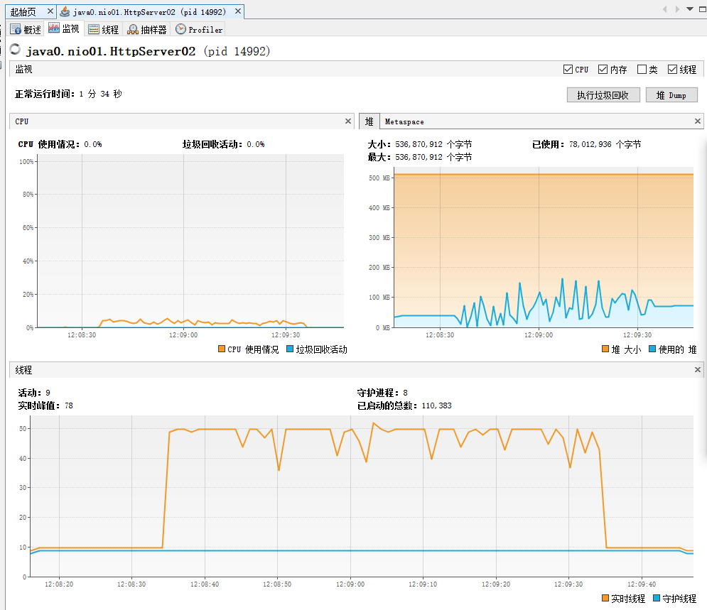
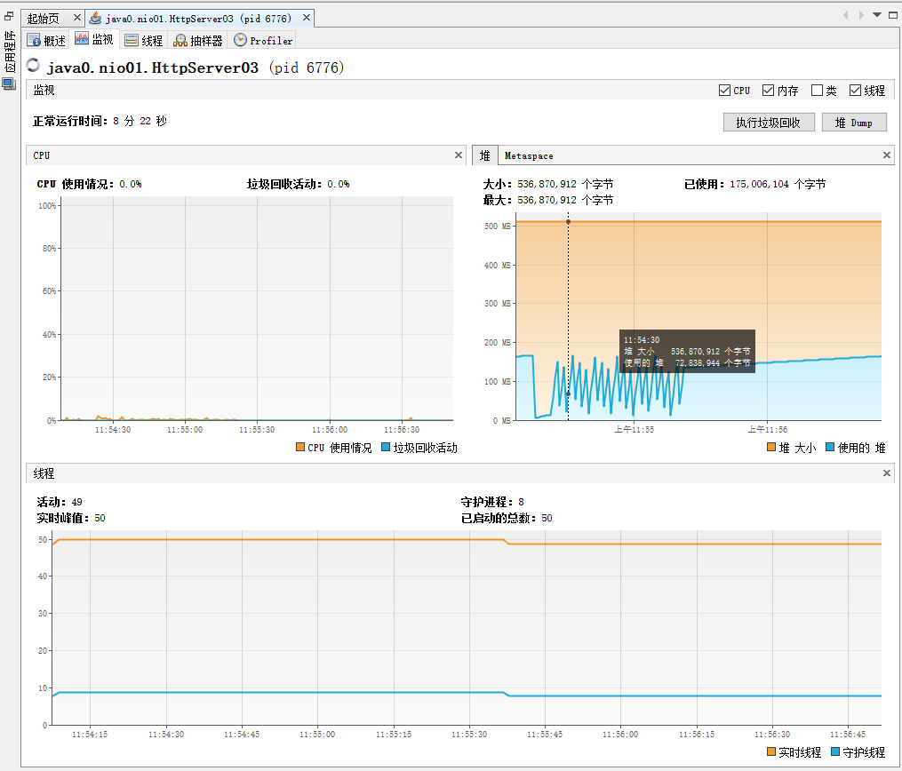

# 周六作业：
1. （可选）运行课上的例子,以及Netty的例子 ,分析相关现象
2. 写一段代码,使用HttpClient或OkHttp 访问Http://localhost:8801,代码提交GitHub

##使用环境
```
个人终端：
处理器：AMD Ryzen 9 4900HS Radeon Graphics 3.00GHZ
RAM：40.0 GB(可用 39.4GB)
类型：x64处理器
```

```
JDK版本：
java version "1.8.0_131"
Java(TM) SE Runtime Environment (build 1.8.0_131-b11)
Java HotSpot(TM) 64-Bit Server VM (build 25.131-b11, mixed mode)
```

```
涉及工具：
IntelliJ IDEA 2020.2
Windows Terminal 1.3.2651.9
SuperBenchmarker 4.5.1
```

## 解题： 
作业详见：ok-http-demo.zip
核心代码：
~~~
/**
 * @author: Ewen
 * @program: ok-http-demo
 * @date: 2020/10/27 22:09
 * @description:
 */
public class OkHttpHandler {

    public static final String REQUEST_URL = "Http://localhost:8801";

    public static void main(String[] args) throws IOException {

        System.out.println(get(REQUEST_URL));
    }

    private static String get(String url) throws IOException {

        Request request = new Request
                .Builder()
                .url(url)
                .build();

        Response response = new OkHttpClient()
                .newCall(request)
                .execute();

        return response.body().string();
    }
}
~~~

## 笔记：

### 实现一个简单的Http服务器

#### 1. 单线程 - HttpServer 
~~~
public static void main(String[] args) throws IOException{
        ServerSocket serverSocket = new ServerSocket(8801);
        while (true) {
            try {
                Socket socket = serverSocket.accept();
                service(socket);
            } catch (IOException e) {
                e.printStackTrace();
            }
        }
    }
    
    private static void service(Socket socket) {
        try {
            Thread.sleep(20);
            PrintWriter printWriter = new PrintWriter(socket.getOutputStream(), true);
            printWriter.println("HTTP/1.1 200 OK");
            printWriter.println("Content-Type:text/html;charset=utf-8");
            printWriter.println();
            printWriter.write("hello,nio");
            printWriter.close();
            socket.close();
        } catch (IOException | InterruptedException e) {
            e.printStackTrace();
        }
    }
~~~

控制堆内存-Xms512m -Xmx512m,同时使用sb 进行压力测试：
~~~
>sb -u http://localhost:8801/ -c 40 -N 60
~~~
结果：
~~~
Starting at 2020/10/27 11:33:56
[Press C to stop the test]
2974    (RPS: 46.8)
---------------Finished!----------------
Finished at 2020/10/27 11:35:00 (took 00:01:03.5832874)
3010    (RPS: 47.4)                     Status 200:    3010

RPS: 49.3 (requests/second)
Max: 821ms
Min: 46ms
Avg: 801.9ms

  50%   below 807ms
  60%   below 808ms
  70%   below 809ms
  80%   below 810ms
  90%   below 812ms
  95%   below 813ms
  98%   below 814ms
  99%   below 815ms
99.9%   below 816ms
~~~
分析：
1. 串行执行(BIO),会阻塞执行;
2. Thread.sleep(20),每次执行会睡20毫秒;

#### 2. 多线程 - HttpServer 
~~~
public static void main(String[] args) throws IOException{
        ServerSocket serverSocket = new ServerSocket(8802);
        while (true) {
            try {
                final Socket socket = serverSocket.accept();
                new Thread(() -> {
                    service(socket);
                }).start();
            } catch (IOException e) {
                e.printStackTrace();
            }
        }
    }
    
    private static void service(Socket socket) {
        try {
            Thread.sleep(20);
            PrintWriter printWriter = new PrintWriter(socket.getOutputStream(), true);
            printWriter.println("HTTP/1.1 200 OK");
            printWriter.println("Content-Type:text/html;charset=utf-8");
            printWriter.println();
            printWriter.write("hello,nio");
            printWriter.close();
            socket.close();
        } catch (IOException | InterruptedException e) {
            e.printStackTrace();
        }
    }
~~~
控制堆内存-Xms512m -Xmx512m,同时使用sb 进行压力测试：
~~~
>sb -u http://localhost:8802/ -c 40 -N 60
~~~
结果：
~~~
Starting at 2020/10/27 11:38:45
[Press C to stop the test]
107283  (RPS: 1688.1)
---------------Finished!----------------
Finished at 2020/10/27 11:39:48 (took 00:01:03.6505191)
Status 200:    103139
Status 303:    4144

RPS: 1755.7 (requests/second)
Max: 91ms
Min: 19ms
Avg: 21ms

  50%   below 20ms
  60%   below 20ms
  70%   below 20ms
  80%   below 21ms
  90%   below 22ms
  95%   below 23ms
  98%   below 40ms
  99%   below 41ms
99.9%   below 46ms
~~~
分析：
1. 对单线程HttpServer进行了优化,通过new Thread开启多线程模式,性能提升显著;
2. 创建了很多的线程,对于系统开销较大,但是线程使用效率很低;



#### 3. 固定大小线程池 - HttpServer 
~~~
public static void main(String[] args) throws IOException{
        ExecutorService executorService = Executors.newFixedThreadPool(40);
        final ServerSocket serverSocket = new ServerSocket(8803);
        while (true) {
            try {
                final Socket socket = serverSocket.accept();
                executorService.execute(() -> service(socket));
            } catch (IOException e) {
                e.printStackTrace();
            }
        }
    }
    
    private static void service(Socket socket) {
        try {
            Thread.sleep(20);
            PrintWriter printWriter = new PrintWriter(socket.getOutputStream(), true);
            printWriter.println("HTTP/1.1 200 OK");
            printWriter.println("Content-Type:text/html;charset=utf-8");
            printWriter.println();
            printWriter.write("hello,nio");
            printWriter.close();
            socket.close();
        } catch (IOException | InterruptedException e) {
            e.printStackTrace();
        }
    }
~~~
控制堆内存-Xms512m -Xmx512m,同时使用sb 进行压力测试：
~~~
>sb -u http://localhost:8803/ -c 40 -N 60
~~~
结果：
~~~
Starting at 2020/10/27 11:50:16
[Press C to stop the test]
109287  (RPS: 1721.6)
---------------Finished!----------------
Finished at 2020/10/27 11:51:20 (took 00:01:03.5572365)
Status 200:    105559
Status 303:    3731

RPS: 1789.1 (requests/second)
Max: 74ms
Min: 19ms
Avg: 20.5ms

  50%   below 20ms
  60%   below 20ms
  70%   below 20ms
  80%   below 20ms
  90%   below 21ms
  95%   below 23ms
  98%   below 40ms
  99%   below 40ms
99.9%   below 44ms
~~~
分析：
1. 通过FixedThreadPool线程池,有效降低了线程创建/关闭消耗,通过线程池高效复用线程达到性能提升和资源消耗降低;
2. 创建线程数>本地核心线程数,是因为线程在sleep期间会释放CPU资源,若创建线程数=本地核心线程数的情况会造成无可用线程使用CPU资源也是一种资源浪费;

### 服务器类型

CPU密集型 = 指的是系统的磁盘读写效率高于cpu效率,此时cpu效率可能达到100%,但是磁盘读写速度很快;
IO密集型 = 指的是系统的cpu效能 比磁盘读写效能要高很多,这时是cpu在等io（磁盘到内存）的读写,此时cpu使用率不高;

### IO模型

1. 阻塞I/O模型
2. IO/复用模型
3. 非阻塞I/O模型
4. 信号驱动的I/O模型
5. 异步I/O模型




